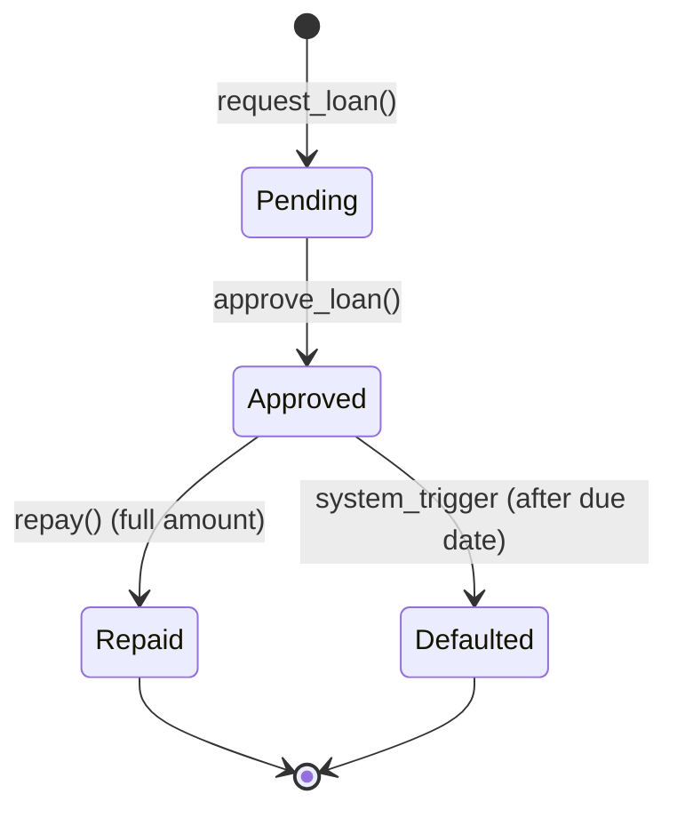

# Soroban Contract State Machine

This document details the state management and lifecycle of loans within the Remitlend Soroban smart contracts.

## Overview

The core logic of Remitlend resides in two primary contracts:
1. **Loan Manager**: Manages the loan lifecycle (Request -> Approve -> Repay/Default).
2. **Remittance NFT**: Tracks user credit scores and locks/unlocks NFTs as collateral.

## Loan Lifecycle State Machine

The `LoanManager` contract defines the following states for a loan:

### 1. Pending
- **Trigger**: `request_loan(borrower, amount)`
- **Conditions**: 
    - Borrower must have a `RemittanceNft`.
    - Credit score must be >= `min_score`.
    - Borrower cannot have an active loan (limit: 1 active loan per user).
- **Actions**: 
    - Increments `LoanCounter`.
    - Stores `Loan` struct in persistent storage.
    - Emits `LoanRequested` event.

### 2. Approved
- **Trigger**: `approve_loan(loan_id)`
- **Conditions**: 
    - Only `Admin` can call this.
    - Loan must be in `Pending` state.
    - Lending Pool must have sufficient liquidity.
- **Actions**:
    - Updates status to `Approved`.
    - Transfers tokens from `LendingPool` to `Borrower`.
    - Emits `LoanApproved` event.

### 3. Repaid
- **Trigger**: `repay(borrower, amount)`
- **Conditions**:
    - Loan must be in `Approved` state.
    - Repayment amount must be positive.
- **Actions**:
    - Updates loan status (if fully repaid).
    - Cross-contract call to `RemittanceNft` to update user's credit score (+points for timely repayment).
    - Emits `LoanRepaid` event.

## Storage Model

### Loan Manager Storage
- `DataKey::Loan(u32)`: Persistent storage for `Loan` structs.
- `DataKey::LoanCounter`: Instance storage for total loans issued.
- `DataKey::MinScore`: Instance storage for prefixing credit worthiness.

### Remittance NFT Storage
- `DataKey::Score(Address)`: User credit score (0-1000).
- `DataKey::AuthorizedMinter(Address)`: Membership flag for each authorized minter address.
- `DataKey::AuthorizedMinters`: Enumerated `Vec<Address>` of authorized minters (max 32).

### Remittance NFT Admin Views
- `is_authorized_minter(addr) -> bool`: Checks whether a specific address can mint.
- `get_authorized_minters() -> Vec<Address>`: Returns the current authorized minter set for audit and admin UIs.

## Security & Constraints
- **Atomic State Transitions**: All state changes are completed within a single Soroban transaction.
- **Auth Checks**: `borrower.require_auth()` and `admin.require_auth()` are used to ensure only authorized parties can trigger transitions.
- **Paused State**: A global `Paused` flag can stop all `request_loan`, `approve_loan`, and `repay` operations in case of emergency.
